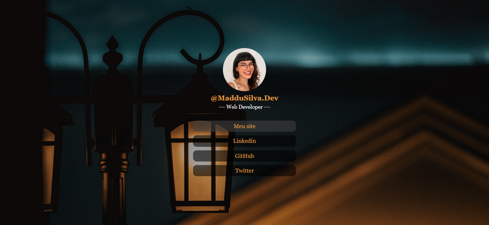

<h1 align="center" id="project_name">
   
    Pagina para bio do Instagram
    
  
   
</h1>

Esse é um projeto pessoal que desenvolvi para meu novo perfil no Instagram, onde compartilho minha jornada pelo estudo de programação de forma autodidata.

<h2 id="about">
💻 Sobre o projeto
</h2>
Com a decisão de criar conteudo sobre tecnologia para o Instagram, decidi deixar o perfil cada vez mais profissional, como boa autodidata, vi uma oportunidade de praticar o que estava estudando. 
 
Uma aplicação web simples, utilizando apenas html e css.
 

 
<h2 id="technologies">🛠 Tecnologias</h2>

As seguintes ferramentas foram usadas na construção do projeto:

- **[HTML](https://exemplo.com)**
- **[CSS](https://exemplo.com)**

> Veja o arquivo [LinkInBio-ByMaddu](https://maddusilva.github.io/link-in-bio/)

**Utilitários**

- Editor: **[Visual Studio Code](https://code.visualstudio.com/)**
- Hospedagem: **[GitHub Pages](https://pages.github.com/)**

<h2 id="author">🦸 Autor</h2>
<a href="#">

 <b> Maria Eduarda da Silva </b></a>

 <h2 id="author">Social</h2>
<a href="#">

 

 

*Made with love ♡ by Maddu* 👋🏽 [Entre em contato!](https://www.linkedin.com/in/maddusilvadev/)
